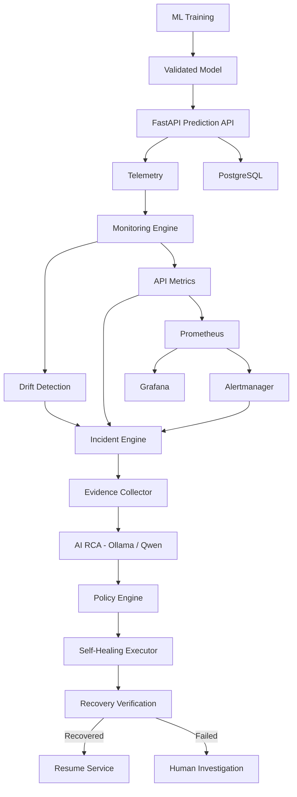

Paste this complete content into `README.md`:

````markdown
# SentinelML

## Intelligent Self-Healing ML Operations Platform

**Real-Time ML API with Automated Drift Detection, AI-Driven Root Cause Analysis, and Policy-Controlled Self-Healing**

SentinelML is an MLOps platform designed to monitor a production machine-learning API, detect operational and data-quality problems, investigate incidents using structured evidence and an LLM, apply policy-controlled recovery actions, and verify whether the system recovered successfully.

---

## Architecture

```text
                         SENTINELML
                              │
                              ▼
                       ┌─────────────┐
                       │   FastAPI   │
                       │  /predict   │
                       └──────┬──────┘
                              │
                              ▼
                        ML Prediction
                              │
                    ┌─────────┴─────────┐
                    ▼                   ▼
               Telemetry            PostgreSQL
                    │
                    ▼
             Monitoring Engine
                    │
              ┌─────┴─────┐
              ▼           ▼
            Drift       API Failure
              │           │
              └─────┬─────┘
                    ▼
             Incident Engine
                    │
                    ▼
            Evidence Collector
                    │
                    ▼
                 AI RCA
             Ollama / Qwen
                    │
                    ▼
              Policy Engine
                    │
                    ▼
            Self-Healing Layer
                    │
                    ▼
                Verification
                 /        \
             Success      Failed
                │            │
                ▼            ▼
             Resume      Human Alert
````

---

## Problem Statement

Machine-learning systems can continue serving predictions even when their production environment starts changing.

Examples include:

* Production feature distributions changing
* API errors increasing
* Prediction latency increasing
* Database connectivity problems
* Unhealthy services
* Unexpected production data

Traditional monitoring can detect that something is wrong, but detection alone does not provide a complete incident-response workflow.

SentinelML adds an automated incident pipeline:

```text
Monitor
   ↓
Detect Incident
   ↓
Collect Evidence
   ↓
AI Root Cause Analysis
   ↓
Policy Decision
   ↓
Controlled Recovery
   ↓
Verify Recovery
   ↓
Resume / Human Investigation
```

---

## Key Features

### 1. Real-Time ML API

FastAPI provides the production prediction service.

Endpoint:

```text
POST /predict
```

The API records:

* Input features
* Prediction
* Failure probability
* Model version
* Request latency
* Prediction timestamp

---

### 2. Machine Failure Prediction

SentinelML uses the **AI4I 2020 Predictive Maintenance Dataset**.

Input features:

* Machine Type
* Air Temperature
* Process Temperature
* Rotational Speed
* Torque
* Tool Wear

Target:

```text
Machine failure
```

The project intentionally excludes identifiers and failure-mode fields from the production feature set.

---

## Model Performance

Baseline Random Forest model:

| Metric    | Result |
| --------- | -----: |
| Accuracy  | 97.95% |
| Precision | 72.13% |
| Recall    | 64.71% |
| F1 Score  | 68.22% |
| ROC-AUC   | 96.12% |

Because machine failures are highly imbalanced, precision, recall, F1, and ROC-AUC are considered alongside accuracy.

---

## 3. Production Telemetry

Prediction telemetry is captured for monitoring.

Example:

```json
{
  "timestamp": "2026-09-18T00:00:00+00:00",
  "prediction": 0,
  "failure_probability": 0.0,
  "latency_ms": 561.78,
  "model_version": "v1"
}
```

Production prediction records can also be stored in PostgreSQL.

---

## 4. Data Drift Detection

SentinelML compares production data against a reference dataset.

The current MVP uses a relative mean-shift detection method.

Conceptually:

```text
Relative Change =
|Production Mean - Reference Mean|
----------------------------------
       |Reference Mean|
```

Current threshold:

```text
0.20
```

A feature is considered drifted when its relative change exceeds the threshold.

Example test:

```text
Torque reference mean:    40.0034
Torque production mean:   60.0050
Relative change:           0.50
Drift detected:            True
```

This demonstrates automated detection of a significant production distribution change.

---

## 5. Incident Engine

Detected problems are converted into structured incidents.

Example:

```json
{
  "incident_type": "DATA_DRIFT",
  "severity": "HIGH",
  "status": "OPEN",
  "reason": "Production data distribution has changed.",
  "affected_features": [
    "Torque [Nm]"
  ]
}
```

Supported incident flows include:

```text
DATA_DRIFT
API_ALERT
```

---

## 6. Evidence Collection

The system does not send an incident to the LLM without context.

The Evidence Collector gathers structured information such as:

* Incident details
* Drift results
* Affected features
* Reference statistics
* Production statistics
* Number of predictions
* Failure predictions
* Model version
* Performance-evidence availability

This creates an evidence package for AI investigation.

---

## 7. AI Root Cause Analysis

SentinelML uses:

```text
Ollama
+
Qwen
```

The AI RCA engine receives structured evidence and produces:

* Root-cause hypothesis
* Supporting evidence
* Confidence
* Recommended action
* Safety validation

The AI is explicitly restricted from inventing unsupported conclusions.

For example, when production ground-truth labels are unavailable:

```text
Observed:
Data drift

Not confirmed:
Model performance degradation
```

The system therefore blocks unsupported performance claims.

---

## 8. Policy-Controlled Self-Healing

The LLM does **not** directly control production recovery.

Instead:

```text
AI Recommendation
       ↓
Policy Engine
       ↓
Allowed Action
       ↓
Healing Executor
```

Current allowed actions:

```text
retry_api
restart_service
quarantine_data
rollback_model
```

Examples:

| Incident         | Controlled Action |
| ---------------- | ----------------- |
| API failure      | restart_service   |
| Data drift       | quarantine_data   |
| Unknown incident | human_review      |

The policy engine prevents unsupported or unsafe actions.

---

## 9. Data Quarantine

When significant data drift is detected, the current policy prevents automatic model rollback.

Instead, affected production records are copied into a quarantine table.

```text
Production Data
      ↓
Drift Detected
      ↓
Incident
      ↓
Policy Decision
      ↓
Quarantine Data
      ↓
Investigation
```

This allows the system to isolate potentially problematic data without automatically changing the production model.

---

## 10. Recovery Verification

Executing a recovery command is not considered proof of recovery.

SentinelML performs post-action verification.

Checks include:

* Database connectivity
* Model availability
* API process health
* Healing execution status

Example:

```json
{
  "verification_status": "RECOVERED",
  "checks": {
    "healing_executed": true,
    "database_healthy": true,
    "model_available": true,
    "api_healthy": true
  }
}
```

If verification fails, the incident is marked as failed and requires further investigation.

---

## 11. Incident Lifecycle

The incident lifecycle is persisted in PostgreSQL.

```text
OPEN
 ↓
HEALING
 ↓
RECOVERED
```

or:

```text
OPEN
 ↓
HEALING
 ↓
FAILED
```

The system also stores:

* Detection timestamp
* Resolution timestamp
* Incident type
* Severity
* Affected features
* Healing actions

---

## 12. Healing Audit Trail

Every healing decision is recorded.

Example:

```text
Incident
   ↓
Selected Action
   ↓
Execution Status
   ↓
Reason
   ↓
Timestamp
```

This provides an audit trail for automated recovery decisions.

---

## 13. Prometheus Monitoring

SentinelML exposes Prometheus metrics through:

```text
GET /metrics
```

Current metrics include:

```text
sentinelml_prediction_requests_total
sentinelml_prediction_failures_total
sentinelml_api_errors_total
sentinelml_prediction_latency_seconds
```

Prometheus continuously scrapes the FastAPI service.

---

## 14. Alerting

Prometheus rules monitor conditions such as:

* API availability
* API errors
* High prediction latency

Alertmanager forwards alerts to:

```text
POST /alerts
```

This connects monitoring directly to the incident pipeline.

```text
Prometheus
    ↓
Alertmanager
    ↓
FastAPI /alerts
    ↓
Incident Engine
    ↓
AI RCA
    ↓
Policy Engine
    ↓
Healing
    ↓
Verification
```

---

## 15. Grafana

Grafana provides production monitoring dashboards.

The dashboard can display:

* Prediction requests
* Machine failure predictions
* Prediction latency
* API errors
* API instance health

---

## 16. PostgreSQL

PostgreSQL stores operational information including:

```text
predictions
incidents
healing_actions
quarantined_predictions
```

This allows SentinelML to maintain persistent operational history.

---

## 17. Docker

The project is containerized using Docker.

Current services:

```text
FastAPI
PostgreSQL
Prometheus
Alertmanager
Grafana
```

Docker Compose manages the services and their networking.

Service communication uses Docker service names.

Example:

```text
api → postgres
```

rather than relying on localhost between containers.

---

## Project Structure

```text
sentinelML/
│
├── data/
│   ├── raw/
│   ├── processed/
│   └── reference/
│
├── monitoring/
│   ├── alert_rules.yml
│   ├── alertmanager.yml
│   └── prometheus.yml
│
├── notebooks/
│   └── data_exploration.ipynb
│
├── scripts/
│   ├── create_tables.py
│   ├── test_drift.py
│   ├── test_drift_pipeline.py
│   ├── test_evidence.py
│   ├── test_rca.py
│   ├── test_policy.py
│   ├── test_healing.py
│   ├── test_verification.py
│   └── ...
│
├── src/
│   ├── api/
│   │   └── main.py
│   │
│   ├── database/
│   │   ├── database.py
│   │   └── models.py
│   │
│   ├── healing/
│   │   ├── healing_executor.py
│   │   ├── policy_engine.py
│   │   └── verification.py
│   │
│   ├── incidents/
│   │   ├── incident_engine.py
│   │   └── incident_lifecycle.py
│   │
│   ├── model/
│   │   └── sentinelml_model.joblib
│   │
│   ├── monitoring/
│   │   ├── drift.py
│   │   ├── metrics.py
│   │   ├── production_data.py
│   │   └── telemetry.py
│   │
│   └── rca/
│       ├── ai_rca_engine.py
│       ├── evidence_collector.py
│       └── rca_engine.py
│
├── tests/
│   └── test_sentinelml.py
│
├── Dockerfile
├── docker-compose.yml
├── requirements.txt
├── .gitignore
└── README.md
```

---

## Technology Stack

### Machine Learning

* Python
* Pandas
* NumPy
* Scikit-learn
* Random Forest
* Joblib

### API

* FastAPI
* Uvicorn
* Pydantic

### MLOps

* MLflow
* PostgreSQL
* SQLAlchemy

### Monitoring

* Prometheus
* Grafana
* Alertmanager

### AI

* Ollama
* Qwen

### Infrastructure

* Docker
* Docker Compose

### Testing

* Pytest
* Custom integration scripts

---

## Running the Project

### 1. Create environment

```powershell
python -m venv .venv
```

Activate:

```powershell
.venv\Scripts\Activate.ps1
```

Install dependencies:

```powershell
pip install -r requirements.txt
```

---

### 2. Create database tables

```powershell
python scripts/create_tables.py
```

---

### 3. Start FastAPI

```powershell
uvicorn src.api.main:app --reload
```

API:

```text
http://localhost:8000
```

Health:

```text
http://localhost:8000/health
```

Metrics:

```text
http://localhost:8000/metrics
```

---

## Docker Compose

Build the API image:

```powershell
docker build -t sentinelml-api:latest .
```

Start the complete monitoring stack:

```powershell
docker compose up -d
```

Check services:

```powershell
docker compose ps
```

---

## Example Prediction

```powershell
curl.exe -X POST "http://localhost:8000/predict?machine_type=M&air_temperature=300.5&process_temperature=310.2&rotational_speed=1500&torque=42.5&tool_wear=120"
```

Example response:

```json
{
  "prediction": 0,
  "prediction_label": "normal",
  "failure_probability": 0.0,
  "model_version": "v1",
  "latency_ms": 561.78
}
```

---

## Monitoring URLs

| Component    | URL                                                      |
| ------------ | -------------------------------------------------------- |
| FastAPI      | [http://localhost:8000](http://localhost:8000)           |
| FastAPI Docs | [http://localhost:8000/docs](http://localhost:8000/docs) |
| Prometheus   | [http://localhost:9090](http://localhost:9090)           |
| Alertmanager | [http://localhost:9093](http://localhost:9093)           |
| Grafana      | [http://localhost:3000](http://localhost:3000)           |

---

## End-to-End Incident Example

### Data Drift

```text
Production Data
      ↓
Torque distribution changes
      ↓
Drift detector
      ↓
DATA_DRIFT incident
      ↓
Evidence collection
      ↓
AI RCA
      ↓
Policy Engine
      ↓
quarantine_data
      ↓
Database quarantine
      ↓
Recovery verification
      ↓
RECOVERED
```

### API Failure

```text
API error
   ↓
Prometheus
   ↓
Alertmanager
   ↓
/alerts
   ↓
API_ALERT incident
   ↓
Evidence
   ↓
AI RCA
   ↓
Policy Engine
   ↓
restart_service
   ↓
Controlled recovery action
   ↓
Verification
   ↓
RECOVERED
```

> In the current MVP, `restart_service` is a policy-approved **simulated** healing action. The system does not directly control the Docker Engine.

---

## Design Principles

### Drift is not automatically model failure

A change in production data distribution does not prove that model performance has degraded.

Production ground-truth labels are required to confirm performance degradation.

### AI does not directly control production

The LLM provides an evidence-based recommendation.

The policy engine decides whether an action is allowed.

### Recovery must be verified

A successful execution command does not automatically mean the system recovered.

SentinelML performs post-action health checks.

### Unknown failures require human investigation

If an incident is outside the configured healing policy, automation is stopped and human review is required.

---

## Future Improvements

Potential future extensions include:

* Real model rollback using a model registry
* Automated retraining pipeline
* Champion/challenger model evaluation
* Feature-level drift statistics such as PSI or KS tests
* Prediction quality monitoring with delayed ground truth
* Distributed tracing
* More advanced incident correlation
* Kubernetes deployment
* Real service restart integration with a controlled orchestration layer
* Role-based access control
* Authentication and authorization
* Production-grade secrets management

---

## Project Objective

SentinelML demonstrates how an ML system can move beyond simple model serving toward an operational MLOps platform capable of:

```text
Observe
  ↓
Detect
  ↓
Investigate
  ↓
Decide
  ↓
Recover
  ↓
Verify
```

The project focuses on **safe, evidence-driven and policy-controlled automation** rather than unrestricted autonomous production changes.

````
